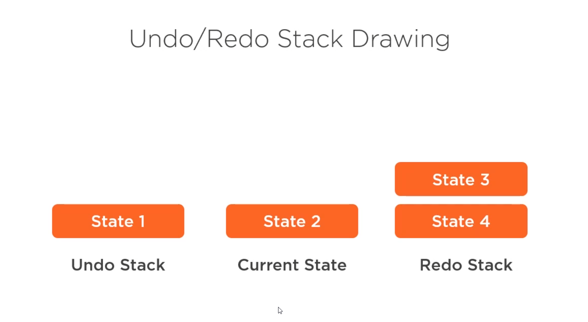

# Memento

Based on (Hangman Kata)[https://github.com/ardalis/kata-catalog/blob/main/katas/Hangman.md]

Good for preserving state of objects. Examples: saving progress in videogames, implementing rollback in graphic applications.

Captures objects internal state.

## Structure:

- Originator: object who's state is being tracked.
- Caretaker: External object that interacts with originator. Performs operations on originator
- Memento: object that holds the internal state of the originator. Owns the complete state of the originator. Access to it should be encapsulated through Originator.

Can be extended to support Redo method by managing and UndoStack and RedoStack separately.

## Refactoring to apply Memento to existing code:

- Define Memento type (as simple as it can be)
- Add save and restore methods to Originator
- Manage stored stacks for redo and undo
